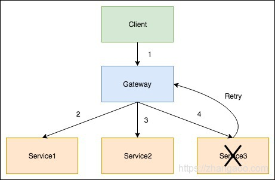

# 背景
微服务通常都要求高可靠性，光靠前面介绍的[Load Balance Rule](https://www.zhangaoo.com/article/ribbon#directory092092130743566310)还不能完全解决我们的问题。如下图：

1. 当请求还在`1`处时，此时如果`Service3`服务不可用了，`Gateway` 中的` Ribbon` 如果使用的`BestAvailableRule`，`AvailabilityFilteringRule`等`Load Balance Rule`的话可以剔除不可用的`Service3`服务，这种情况服务不会出错。
2. 但是当请求已经经由`Gateway`转发已经到达了`4`处时，如果只配置`Load Balance Rule`的话已经无能为力了，因为`Load Balance Rule`只是做`Server`的选择，此时已经选定`Service3`，这种情况就会导致本次调用出错。
3. 如果我们配置使用了`Ribbon`的`Retry`策略的话，即使请求已经到达`4`处，并且本次会请求失败，但是在请求失败后可以根据策略进行一次或多次`Retry`，尝试的机制则可以最大限度的规避这种特殊情况的服务不可用用的情况



# 配置使用Retry策略
基本架构如下：
1. 一个 `Eureka` (非集群模式，集群模式配置有差异)
2. 一个网关（`Gateway`）反向代理服务，ribbon做`LB Rule`，`Retry`模块做失败请求`Retry`;网关从`Eureka`发现服务并反向代理；
3. 三个服务节点，把服务注册到`Eureka`

# 配置注意点
## Eureka

```yml
server:
  port: 7001

eureka:
  instance:
    hostname: localhost
  client:
    registerWithEureka: false # 不把自己注册到服务注册中心
    fetchRegistry: false #不从服务注册中心取服务，因为是单节点的Eureka，因此只提供给服务注册和网关取服务
    service-url:
       defaultZone: http://${eureka.instance.hostname}:${server.port}/eureka/
  server:
    enable-self-preservation: false #在调试时关闭eureka注册中心的保护机制

```

## 服务模块

```yml
spring:
  application:
    name: service-provide #服务的名称，如果是一个服务集群，则此名字必须一样
server:
  host: 127.0.0.1
  port: 0
eureka:
  client:
    service-url:
      defaultZone: http://127.0.0.1:7001/eureka/
  instance:
    instance-id: user-service1 #相同的服务，本字段也必须唯一，也就是一个同一个服务集群本字段也不能相同
```

## 网关模块

```yml
server:
  port: 8080

spring:
  application:
    name: zuul-gateway
eureka:
   instance:
     hostname: localhost
   client:
     register-with-eureka: false
     fetch-registry: true
     service-url:
       defaultZone: http://${eureka.instance.hostname}:7001/eureka/
zuul:
  routes:
    skytsdb:
      path: /**
      serviceId: service-provide
      retryable: true

#负载均衡规则，根据ServiceID设置，重点就是这几行配置
service-provide:
  ribbon:
    NFLoadBalancerRuleClassName: com.netflix.loadbalancer.AvailabilityFilteringRule
    MaxAutoRetries: 0           # Max number of retries on the same server (excluding the first try)
    MaxAutoRetriesNextServer: 3 # Max number of next servers to retry (excluding the first server)
    OkToRetryOnAllOperations: true
```

- 注意POM需`retry`模块依赖
不在该模块正常请求也不会报错，但当有请求失败的时候不会进行尝试会直接报错

```xml
    <dependency>
        <groupId>org.springframework.retry</groupId>
        <artifactId>spring-retry</artifactId>
    </dependency>
```

## 完整github代码
- https://github.com/zealzhangz/SpringCloud-Ribbon-Retry